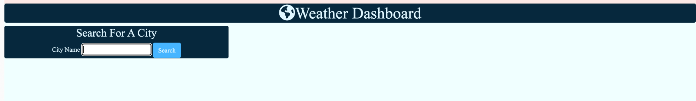
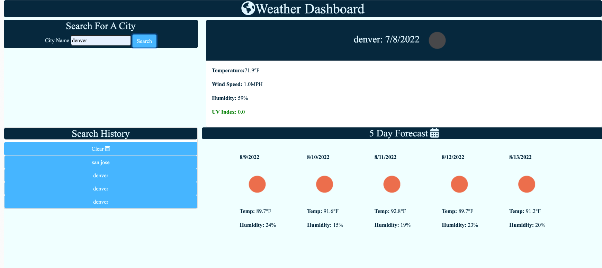

# Weather_Dashboard_App

## Description

A Weather Dashboard application allows a user to see the weather outlook for multiple cities.

Deployed app: https://github.com/kaihuan-huang/Weather_Dashboard_App

Gitpage: https://kaihuan-huang.github.io/Weather_Dashboard_App/

- Presented with current and future conditions for that city, and that city is added to the search history.

- Presented with the city name, the date, an icon representation of weather conditions, the temperature, the humidity, the wind speed, and the UV index

- Presented with a color that indicates whether the conditions are favorable, moderate, or severe

- Presented with a 5-day forecast that displays the date, an icon representation of weather conditions, the temperature, the wind speed, and the humidity

- Clicked on a city in the search history will present with current and future conditions for that city again;

Mock-up

## Screenshots

The following images demonstrate the web application's appearance:

---